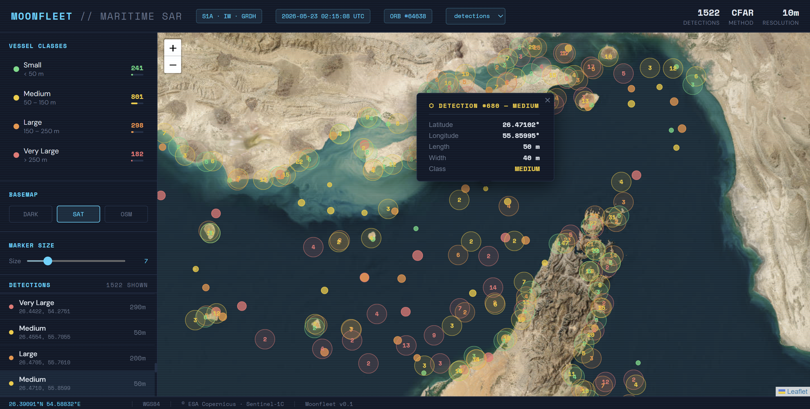

# moonfleet
# 🛰️ Moonfleet — Sentinel-1 SAR Ship Detection Pipeline


Automated ship detection pipeline for Sentinel-1 GRD imagery using ESA SNAP GPT.
Leveraging data science and deep SAR processing to extract maritime intelligence
from C-band radar data — all-weather, day and night.

---

## Results — Strait of Hormuz



*Sentinel-1C IW GRD — April 20th 2026 — Example of CFAR detection over the Strait of Hormuz, off Saudi Arabia*
*Nicer visuals incoming*

---

## Features

- Full Sentinel-1 GRD preprocessing chain (orbit, calibration, speckle filtering, terrain correction)
- CFAR adaptive thresholding for ship detection
- Land-sea masking to eliminate false alarms on coastlines
- Object discrimination by size (min/max target size in meters)
- Configurable AOI via WKT polygon passed as CLI argument
- Lightweight Python wrapper around SNAP GPT — no snappy required

---

## Project Structure

```
moonfleet/
├── src/
│   └── relics/               # Obsolete scripts  
│   └── naive.py              # Main processing script
├── graphs/
│   └── CFAR.xml              # SNAP GPT processing graph
├── notebooks/                # Notebooks to handcraft new features  
├── scripts/
│   └── generate_readme.py    # README auto-generation via Claude API (soon to be tested)
├── assets/display/
│   └── hormuz_display.png # Result image for README
├── outputs/                  # Processing outputs (gitignored)
├── data/                     # Raw Sentinel-1 data (gitignored)
├── moonfleet_env_light.yml   # Manually added librairies
├── moonfleet_env_full.yml    # Full conda environment (with automatically added dependencies)
├── .gitignore
└── README.md
```

---

## Installation

```bash
# Clone the repository
git clone https://github.com/guigu/moonfleet.git
cd moonfleet

# Using conda/mamba: create and activate conda environment (other solutions possible)
conda env create -f moonfleet_env_light.yml
conda activate moonfleet
```

**Requirements:**
- [ESA SNAP 13](https://step.esa.int/main/download/snap-download/) installed on your system
- Ability to create a clean virtual environment 
- Sentinel-1 GRD data (`.zip` or `.SAFE`)

---

## Usage

```bash
python src/naive.py \
  --graph graphs/CFAR.xml \
  --input path/to/S1A_IW_GRDH_1SDV_...zip \
  --aoi "POLYGON((55.886573 26.104849,54.503174 25.85428,54.637756 25.269536,56.063721 25.56760,55.886573 26.104849))"\
  --output outputs/result.dim 
```

### Arguments

| Argument | Required | Default | Description |
|---|---|---|---|
| `--graph` | ✅ | — | Path to the SNAP XML graph file |
| `--input` | ✅ | — | Path to the Sentinel-1 input file (`.zip` or `.SAFE`) |
| `--output` | ✅ | — | Path for the output file (`.dim`) |
| `--aoi` | ✅ | — | Area of interest as WKT polygon (lon lat pairs) |
| `--gpt` | ❌ | `C:\Program Files\esa-snap\bin\gpt.exe` | Path to SNAP GPT executable |

---

## SNAP Processing Graph

### CFAR.xml

Complete Sentinel-1 GRD processing chain for maritime ship detection:

| Step | Operator | Description |
|---|---|---|
| 1 | Read | Load Sentinel-1 GRD product |
| 2 | Apply-Orbit-File | Apply precise orbit restitution (auto download) |
| 3 | ThermalNoiseRemoval | Remove thermal noise floor |
| 4 | Calibration | Radiometric calibration to Gamma0 |
| 5 | Speckle-Filter | Lee Sigma speckle reduction (3×3) |
| 6 | Terrain-Correction | Geometric correction using Copernicus 30m DEM |
| 7 | Subset | Crop to AOI using WKT polygon |
| 8 | Land-Sea-Mask | Mask land pixels |
| 9 | AdaptiveThresholding | CFAR detection |
| 10 | Object-Discrimination | Filter detections by size |
| 11 | Write | Export to BEAM-DIMAP format |

---

## Output

The pipeline produces a **BEAM-DIMAP** product (`.dim` + `.data/` folder) containing:

- `Gamma0_VH` — calibrated VH backscatter band
- `Gamma0_VV` — calibrated VV backscatter band  
- `Gamma0_VH_ship_bit_msk` — binary ship detection mask
- Object Detection Report XML in `~/.snap/var/log/` (soon to be converted in CSV format and post-processed properly)
---

## Dependencies

| Package | Version | Usage |
|---|---|---|
| Python | 3.11 | Runtime |
| ESA SNAP | 13 | SAR processing engine |

---

## License

MIT